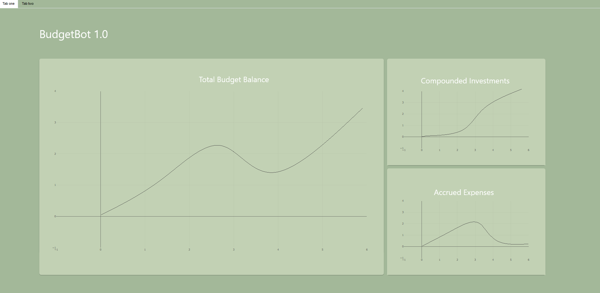
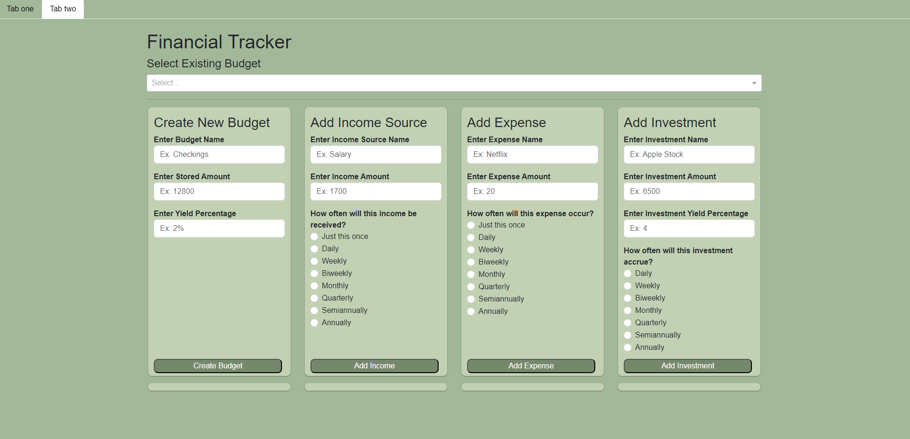

# BudgetBot

BudgetBot is a Python project designed to simplify the process of visualizing and managing your personal budget. 

## Features

- **Interactive Web App Interface:** BudgetBot provides a user-friendly web app interface built using Dash.

- **Budget Creation and Management:** Users can create and manage their budgets directly through the web app. Whether it's mapping out monthly expenses, computing yearly returns from investments, or managing an entire budget.

- **Backend Database:** BudgetBot employs a backend database to store user profiles to ensure that  budget information is persistent and can be accessed across sessions.

- **Customization:** Tailor BudgetBot to your specific financial needs. Customize categories, set budget limits, and track your spending patterns.

# Example Images of App



# Setup

1. **Clone the Repository:**
   ```git clone https://github.com/WillCBarker/BudgetBot.git```

2. **Navigate to Project Directory**
   ```cd budgetbot```

3. **Run the project:**
  ```python app.py```
